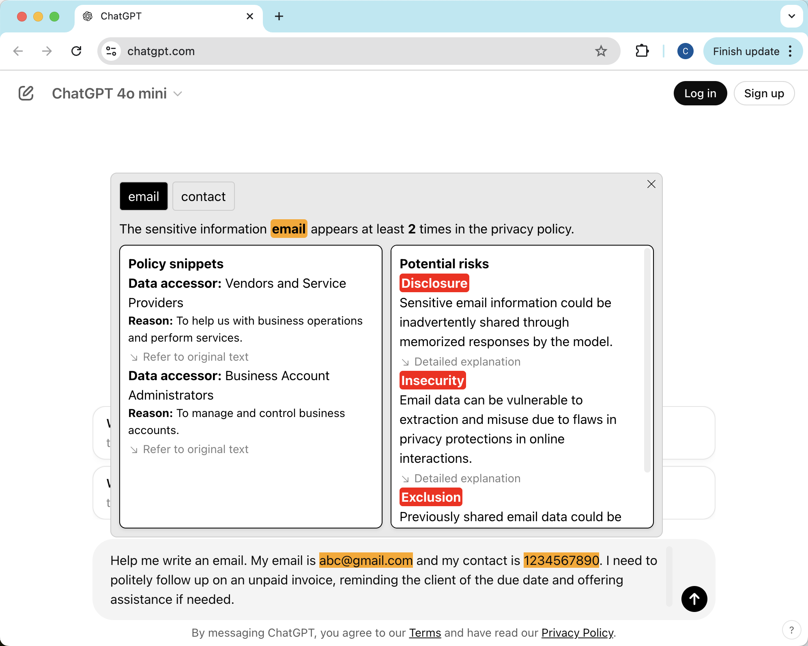

# CLEAR

## Load and Test

### Install all the dependency
- In your terminal or cmd, direct to the AIConsentNew folder (On Mac, type `cd <your path>/AIConsentNew` in your terminal)
- We recommend you to create a virtual environment to run the backend, you can use create the virtual environment by running `python3 -m venv venv` (use `python` on Windows)
- Activate virtual environment in `venv` (On Mac, type `source venv/bin/activate` in your terminal. On Windows, type `venv\Scripts\activate` in your cmd).
- Install all the python libraries in requirements by running `pip install -r requirements.txt`

### Enter API Key
-  Go to `/backend` and open `config.ini`. Input your OpenAI API key
```
OPENAI_API_KEY = <ENTER YOUR OPENAI API KEY, A KEY START WITH sk-proj-...>
``` 

### Load the plugin
- Open Chrome and go to `chrome://extensions/`.
- Enable "Developer mode".
- Click "Load unpacked" and select `plugin` folder.
- Make sure you enable the plugin `CLEAR 2.0`

### Start the backend
- Running backend by first `cd backend` and then run `uvicorn app:app` in your terminal or cmd.

### Case 1: ChatGPT
- Visit ChatGPT and test the extension (so far we only support three trigger phrases: `personal email, personal address, personal contact`).
- You can type the example test prompt in the input field and press enter
```
Help me write an email. My email is abc@gmail.com and my contact is 1234567890. I need to politely follow up on an unpaid invoice, reminding the client of the due date and offering assistance if needed.
```
- You will see the following pop-up if the plugin runs well

- Click `Know more...` and wait for a while, you will see the detailed information


### Case 2: Gmail
- Before test it, make sure you have subscribed Gemini Advanced
- You can send yourself a test email:
```
As we discussed and as a reminder, we should quickly move to structure an employment agreement for David Hultsman. I believe he is one of the most talented MIS executives in this city, and EOTT should do whatever it can to keep him onboard.

Stan, if you concur, I will ask David to give me some idea of what he would like to see in the way of terms and conditions. Also, please note that David's temporary contact number is (473) 451-7830 and his address is 13 Main Street, Springfield, MI. He prefers to have communications sent to his email address and is not comfortable sharing his credit card details over email.

Thanks,
Mike
```
- Open this email and enable Gemini at the top right, you will see the text in the input box has been replaced as `My input field`

- You can type the example test prompt in the input field `Summarize this email` and press enter
- You will see the following pop-up if the plugin runs well

- Click `Know More...` and wait for a while, you will see the detailed information

- Note that there is some issue with the `Send Out` button, so please do not try it now.